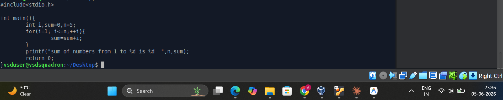
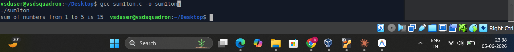
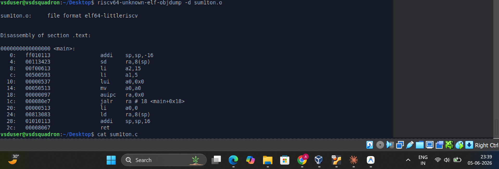

# TASK 1 - RISC-V C Program Compilation and Assembly Analysis

**VSDSquadron Mini Research Internship**
Internship offered by [VLSI System Design (VSD)](https://www.vlsisystemdesign.com/)

---

## Objective

To write a simple C program that computes the sum of numbers from 1 to N, compile it using both
the native GCC compiler and the RISC-V GCC cross-compiler, and analyze the generated RISC-V
assembly instructions using objdump to understand how C code maps to RISC-V machine instructions.

---

## Table of Contents

- [Program Used](#program-used)
- [Code Explanation](#code-explanation)
- [Commands and Explanation](#commands-and-explanation)
- [Screenshots](#screenshots)
- [Key Observations](#key-observations)
- [Conclusion](#conclusion)

---

## Program Used

The program chosen for Task 1 is a sum calculator written in C. It computes the sum of all
integers from 1 to N and prints the result.

```c
#include<stdio.h>
int main(){
    int i, sum=0, n=5;
    for(i=1; i<=n; ++i){
        sum=sum+i;
    }
    printf("sum of numbers from 1 to %d is %d\n", n, sum);
    return 0;
}
```

---

## Code Explanation

| Line | Code | Explanation |
|------|------|-------------|
| 1 | `#include<stdio.h>` | Includes the standard input/output header file to enable use of `printf` |
| 2 | `int main()` | Entry point of the program; returns an integer status code to the operating system |
| 3 | `int i, sum=0, n=5;` | Declares loop counter `i`, accumulator `sum` initialized to 0, and upper limit `n` set to 5 |
| 4 | `for(i=1; i<=n; ++i)` | Iterates from 1 to n inclusive, incrementing by 1 each cycle using the prefix increment operator |
| 5 | `sum=sum+i;` | Adds the current loop index to the running total on each iteration |
| 6 | `printf(...)` | Prints the result; `%d` is used for both the integer `n` and the integer `sum` |
| 7 | `return 0;` | Returns 0 to signal successful termination |

---

## Commands and Explanation

### Command 1: Create the source file

```bash
nano sum1ton.c
```

Opens the `nano` terminal text editor to create and write the C source file. After typing the
program, save with `Ctrl+O` and exit with `Ctrl+X`.

---

### Command 2: Verify the source code

```bash
cat sum1ton.c
```

Displays the full contents of `sum1ton.c` in the terminal to confirm the file was saved correctly
before compilation.

---

### Command 3: Compile with native GCC

```bash
gcc sum1ton.c -o sum1ton
```

Compiles the C source file using the system's native GCC compiler targeting the local x86-64
architecture. The `-o sum1ton` flag names the output executable.

---

### Command 4: Run the compiled program

```bash
./sum1ton
```

Executes the compiled binary on the local machine.

Expected output:

```
sum of numbers from 1 to 5 is 15
```

---

### Command 5: Cross-compile for RISC-V 64-bit

```bash
/home/vsduser/Desktop/riscv/bin/riscv64-unknown-elf-gcc -O1 -mabi=lp64 -march=rv64i -c sum1ton.c -o sum1ton.o
```

Cross-compiles the program for the RISC-V 64-bit architecture.

Flag breakdown:

| Flag | Meaning |
|------|---------|
| `-O1` | Level-1 compiler optimization for balanced performance |
| `-mabi=lp64` | Use 64-bit integer, long, and pointer ABI |
| `-march=rv64i` | Target the 64-bit RISC-V base integer ISA |
| `-c` | Compile only to object file, do not link |
| `-o sum1ton.o` | Name the output object file |

---

### Command 6: Disassemble with objdump

```bash
/home/vsduser/Desktop/riscv/bin/riscv64-unknown-elf-objdump -d sum1ton.o
```

Disassembles the RISC-V object file to display the assembly instructions generated from the C
source code. The `-d` flag requests disassembly of all executable sections.

---

## Screenshots

### Screenshot 1 - C Source Code in Terminal



Shows the `sum1ton.c` source code displayed in the terminal using `cat sum1ton.c`. The program
includes the `stdio.h` header, declares variables `i`, `sum`, and `n`, and uses a `for` loop to
accumulate the sum, followed by a `printf` call to display the result.

---

### Screenshot 2 - GCC Compilation and Execution Output



Shows the native GCC compilation completing without errors and the program running with the output:

```
sum of numbers from 1 to 5 is 15
```

This confirms the program logic is correct on the local x86-64 machine.

---

### Screenshot 3 - RISC-V objdump Assembly Output



Shows the disassembled RISC-V object file. Key details visible:

- File format: `elf64-littleriscv`
- `main` function at address `0x0000000000000000`
- `addi sp, sp, -16` allocates stack space
- `sd ra, 8(sp)` saves the return address
- `li a2, 15` loads the precomputed result (compiler optimized the loop to a constant)
- `li a1, 5` loads the value of `n`
- `lui a0, 0x0` and `auipc ra, 0x0` are used to form the format string address
- `jalr ra` calls `printf`
- `li a0, 0` loads return value 0
- `ld ra, 8(sp)` restores return address
- `addi sp, sp, 16` deallocates stack frame
- `ret` returns from `main`

---

## Key Observations

- The program produces the expected output `sum of numbers from 1 to 5 is 15` confirming correct
  logic on the native x86 machine.
- The RISC-V compiler with `-O1` optimization computed the sum at compile time, replacing the
  entire for loop with a single `li a2, 15` instruction. This is called constant folding.
- The RISC-V assembly uses simple, fixed-length instructions consistent with the RISC design
  philosophy. Each operation (load, store, arithmetic, branch) is a separate instruction.
- The stack frame is explicitly set up with `addi sp, sp, -16` and torn down with
  `addi sp, sp, 16`, with the return address saved to and restored from the stack.
- Register `a0` holds the first function argument (format string address), `a1` holds the second
  argument (`n`), and `a2` holds the third argument (`sum`), following the RISC-V calling
  convention.

---

## Conclusion

Task 1 demonstrated the end-to-end flow of writing a simple C program, verifying it on the
native x86 machine using GCC, cross-compiling it for the RISC-V 64-bit architecture using the
RISC-V GCC toolchain, and analyzing the generated assembly using objdump. The disassembly
revealed how the compiler translates high-level C constructs into the simple, load/store
RISC-V instruction set, and showed how compiler optimizations can significantly reduce the
number of instructions generated.

---

## Tools Used

| Tool | Purpose |
|------|---------|
| nano | Terminal text editor for writing C source files |
| GCC | Native C compiler for x86-64, used for logic verification |
| riscv64-unknown-elf-gcc | RISC-V cross-compiler for generating RISC-V object files |
| riscv64-unknown-elf-objdump | Disassembler for inspecting RISC-V assembly output |

---

## Author

**Adarsh Chauhan**
VSDSquadron Mini RISC-V Research Internship

GitHub: [Adarshchauhan123](https://github.com/Adarshchauhan123)
