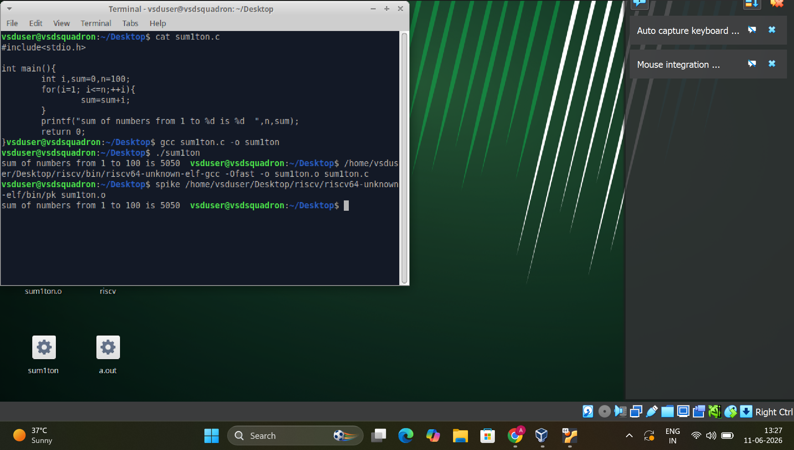
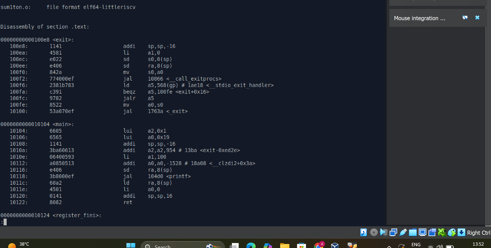
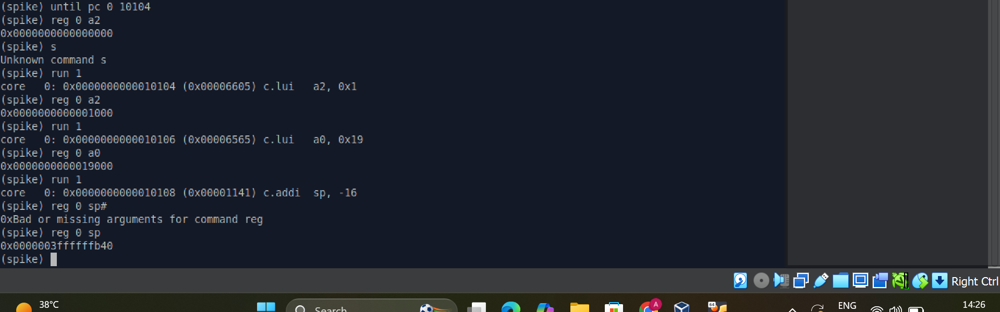
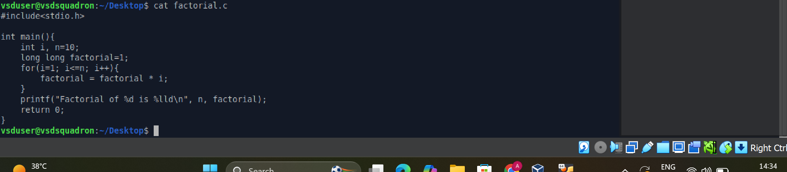
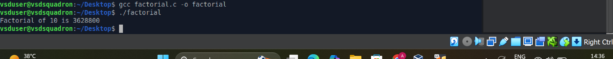
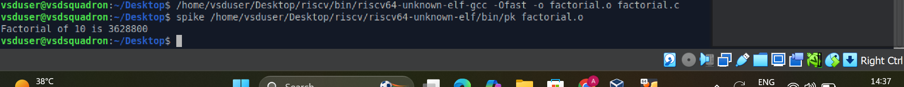
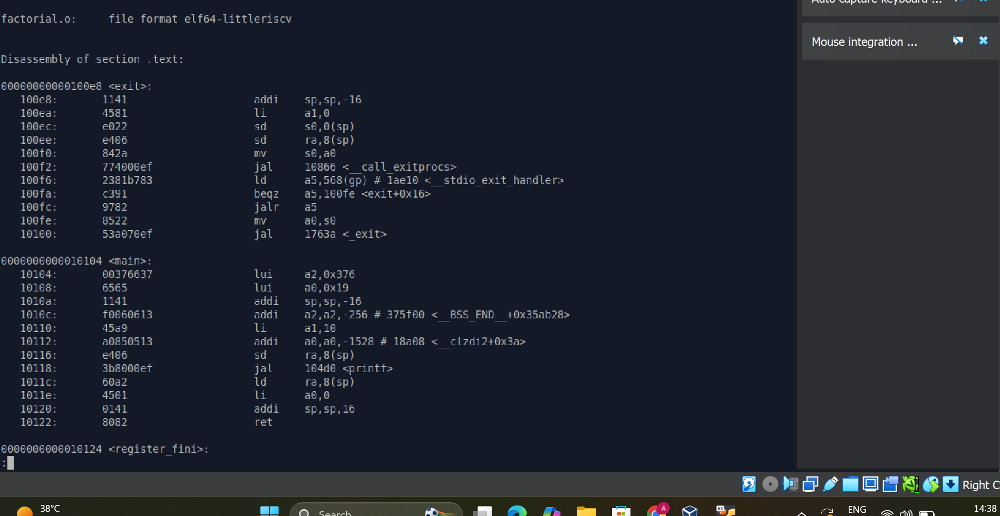

# TASK 2 - RISC-V Compilation, Simulation and Debugging

**VSDSquadron Mini Research Internship**
Internship offered by [VLSI System Design (VSD)](https://www.vlsisystemdesign.com/)

---

## Overview

The goal of Task 2 is to write custom C programs, compile them using GCC and the RISC-V GCC
cross-compiler, simulate execution using the Spike RISC-V ISA simulator, inspect the generated
assembly using objdump, and debug register values using the Spike interactive debugger. This task
demonstrates the complete workflow from C source code to RISC-V hardware-level execution.

Two programs are covered in this task:

- Program 1: Sum of Numbers from 1 to N
- Program 2: Factorial of a Number

---

## Table of Contents

- [Program 1 - Sum of Numbers from 1 to N](#program-1---sum-of-numbers-from-1-to-n)
  - [Code](#code-sum1ton)
  - [Code Explanation](#code-explanation-sum1ton)
  - [Commands and Explanation](#commands-and-explanation-sum1ton)
  - [Screenshots](#screenshots-sum1ton)
  - [Key Observations](#key-observations-for-program-1)
- [Program 2 - Factorial of a Number](#program-2---factorial-of-a-number)
  - [Code](#code-factorial)
  - [Code Explanation](#code-explanation-factorial)
  - [Commands and Explanation](#commands-and-explanation-factorial)
  - [Screenshots](#screenshots-factorial)
  - [Key Observations](#key-observations-for-program-2)
- [Overall Conclusion](#overall-conclusion)

---

## Program 1 - Sum of Numbers from 1 to N

### Code (sum1ton) <a name="code-sum1ton"></a>

```c
#include<stdio.h>
int main(){
    int i, sum=0, n=100;
    for(i=1; i<=n; ++i){
        sum=sum+i;
    }
    printf("sum of numbers from 1 to %d is %d\n", n, sum);
    return 0;
}
```

---

### Code Explanation (sum1ton) <a name="code-explanation-sum1ton"></a>

| Line | Code | Explanation |
|------|------|-------------|
| 1 | `#include<stdio.h>` | Includes the standard input/output header file to enable use of `printf` for printing output to the terminal |
| 2 | `int main()` | Defines the main function, which is the entry point of every C program; returns an integer status code to the operating system |
| 3 | `int i, sum=0, n=100;` | Declares three integer variables: `i` is the loop counter, `sum` is initialized to 0 and will accumulate the total, `n` is set to 100 as the upper limit of the summation |
| 4 | `for(i=1; i<=n; ++i)` | Begins a for loop starting at `i=1`, continuing while `i` is less than or equal to `n` (100), incrementing `i` by 1 on each iteration using the prefix increment operator |
| 5 | `sum=sum+i;` | Adds the current value of `i` to the running total `sum` on each iteration; after the loop completes, `sum` holds the total of all integers from 1 to 100 |
| 6 | `printf(...)` | Prints the final result to the terminal; `%d` is the format specifier for integers, substituting `n` and `sum` into the output string |
| 7 | `return 0;` | Returns 0 to signal that the program completed successfully without errors |

---

### Commands and Explanation (sum1ton) <a name="commands-and-explanation-sum1ton"></a>

#### Command 1: Create the source file

```bash
nano sum1ton.c
```

Opens the `nano` terminal text editor to create a new file named `sum1ton.c`. The user types the
C source code into the editor. Save the file with `Ctrl+O` and exit with `Ctrl+X`.

---

#### Command 2: Verify the source code

```bash
cat sum1ton.c
```

Displays the full contents of `sum1ton.c` directly in the terminal. This confirms that the program
was written and saved correctly before proceeding to compilation.

---

#### Command 3: Compile with GCC for the local machine

```bash
gcc sum1ton.c -o sum1ton
```

Compiles the C source file using the system's native GCC compiler, which targets the local x86-64
architecture. The `-o sum1ton` flag specifies the name of the compiled output executable.

---

#### Command 4: Run the compiled program on the local machine

```bash
./sum1ton
```

Executes the compiled binary on the local x86 machine.

Expected output:

```
sum of numbers from 1 to 100 is 5050
```

This step verifies that the program logic is correct before cross-compiling for RISC-V.

---

#### Command 5: Cross-compile for RISC-V 64-bit architecture

```bash
/home/vsduser/Desktop/riscv/bin/riscv64-unknown-elf-gcc -Ofast -o sum1ton.o sum1ton.c
```

Cross-compiles the C program for the RISC-V 64-bit architecture using the RISC-V GCC toolchain
installed at the specified path.

Flag breakdown:

| Flag | Meaning |
|------|---------|
| `-Ofast` | Applies maximum compiler optimization, enabling aggressive transformations for best performance |
| `-o sum1ton.o` | Names the output file `sum1ton.o`, which is a RISC-V ELF (Executable and Linkable Format) binary |

The resulting binary targets RISC-V and cannot run directly on the host x86 machine. It must be
executed using a RISC-V simulator such as Spike.

---

#### Command 6: Run on the Spike RISC-V ISA Simulator

```bash
spike /home/vsduser/Desktop/riscv/riscv64-unknown-elf/bin/pk sum1ton.o
```

Runs the RISC-V ELF binary using the Spike ISA simulator. Spike is a reference software
implementation of the RISC-V ISA that simulates a RISC-V processor. The proxy kernel (`pk`)
handles system calls such as `printf` on behalf of the program, bridging it to the host operating
system.

Expected output:

```
sum of numbers from 1 to 100 is 5050
```

The output matches the native GCC result, confirming the program works correctly on the RISC-V
architecture.

---

#### Command 7: Disassemble the RISC-V binary using objdump

```bash
/home/vsduser/Desktop/riscv/bin/riscv64-unknown-elf-objdump -d sum1ton.o | less
```

Disassembles the RISC-V ELF binary to display the assembly instructions generated by the compiler.
The `-d` flag requests disassembly of all executable sections. The output is piped to `less` for
paginated viewing. Press `q` to exit the viewer.

This command reveals the actual RISC-V machine instructions corresponding to the C source code,
including the `main` function and linked runtime functions.

---

#### Command 8: Launch Spike in interactive debug mode

```bash
spike -d /home/vsduser/Desktop/riscv/riscv64-unknown-elf/bin/pk sum1ton.o
```

Starts the Spike simulator in interactive debug mode. Execution pauses at the start, allowing
step-by-step instruction tracing and register inspection.

Debugger commands used inside Spike:

| Command | Purpose |
|---------|---------|
| `until pc 0 10104` | Runs the simulator on core 0 until the program counter reaches `0x10104`, which is the address of the `main` function as identified from the objdump output |
| `reg 0 a2` | Reads and displays the current value of register `a2` on core 0 |
| `run 1` | Executes exactly one instruction and pauses, enabling single-step tracing |
| `reg 0 sp` | Reads and displays the current value of the stack pointer `sp` on core 0 |
| `q` | Quits the Spike debugger and exits the session |

---

### Screenshots (sum1ton) <a name="screenshots-sum1ton"></a>

#### Screenshot 1 - sum1ton_code.png



Shows the output of `cat sum1ton.c` in the terminal, displaying the complete C source code of the
sum program. Confirms the file was created and saved correctly before compilation.

---

#### Screenshot 2 - sum1ton_gcc_output.png


Shows the native GCC compilation (`gcc sum1ton.c -o sum1ton`) completing without errors, followed
by running `./sum1ton` which produces the output:

```
sum of numbers from 1 to 100 is 5050
```

This confirms that the program logic is correct on the local x86 machine.

---

#### Screenshot 3 - sum1ton_spike_output.png


Shows the RISC-V cross-compilation command followed by running the binary on the Spike ISA
simulator. The output `sum of numbers from 1 to 100 is 5050` is identical to the native result,
confirming successful cross-compilation and simulation on RISC-V.

---

#### Screenshot 4 - sum1ton_objdump.png



Shows the disassembled RISC-V ELF binary. The file format is confirmed as `elf64-littleriscv`.
The `main` function starts at address `0x0000000000010104`. Visible instructions include:

- `lui` - loads upper 20-bit immediate into a register
- `addi` - adds an immediate value to a register, used here for stack allocation
- `sd` - stores a 64-bit doubleword to memory (saves return address)
- `jal` - jump and link, used to call `printf`
- `ld` - loads a 64-bit value from memory
- `li` - loads an immediate constant into a register
- `ret` - returns from the `main` function

---

#### Screenshot 5 - sum1ton_debug.png



Shows the full Spike debug session with step-by-step register inspection:

| Step | Command | Observed Value | Meaning |
|------|---------|----------------|---------|
| Stop at main | `until pc 0 10104` | PC = 0x10104 | Simulator stopped at start of `main` |
| Check a2 before LUI | `reg 0 a2` | `0x0000000000000000` | Register a2 is initially zero |
| Execute LUI instruction | `run 1` | `lui a2, 0x1` | LUI instruction executed |
| Check a2 after LUI | `reg 0 a2` | `0x0000000000001000` | Upper 20 bits loaded; lower 12 bits are zero |
| Check sp before addi | `reg 0 sp` | `0x0000003fffffffb50` | Stack pointer before frame allocation |
| Execute addi instruction | `run 1` | `c.addi sp, -16` | Stack allocation instruction executed |
| Check sp after addi | `reg 0 sp` | `0x0000003fffffffb40` | Stack pointer decremented by exactly 16 bytes |

---

### Key Observations for Program 1

- The same C program produces identical output (`sum of numbers from 1 to 100 is 5050`) on both
  the native x86 GCC compilation and the RISC-V Spike simulation, confirming cross-platform
  compatibility of the toolchain.
- The stack pointer decreased from `0x0000003fffffffb50` to `0x0000003fffffffb40`, a reduction of
  exactly 16 bytes, after the `addi sp, sp, -16` instruction. This confirms correct stack frame
  allocation as required by the RISC-V ABI.
- The `LUI a2, 0x1` instruction loaded `0x0000000000001000` into register `a2`. This is the value
  `0x1` shifted left by 12 bits, placing the immediate in the upper 20 bits and leaving the lower
  12 bits as zero. A subsequent `addi` instruction fills in the remaining bits to form the full
  immediate value.
- The RISC-V assembly uses simple, fixed-length instructions. Operations that may be single complex
  instructions on x86 require a sequence of simpler RISC-V instructions, which is the core
  principle of the Reduced Instruction Set Computing design.

---

## Program 2 - Factorial of a Number

### Code (factorial) <a name="code-factorial"></a>

```c
#include<stdio.h>
int main(){
    int i, n=10;
    long long factorial=1;
    for(i=1; i<=n; i++){
        factorial = factorial * i;
    }
    printf("Factorial of %d is %lld\n", n, factorial);
    return 0;
}
```

---

### Code Explanation (factorial) <a name="code-explanation-factorial"></a>

| Line | Code | Explanation |
|------|------|-------------|
| 1 | `#include<stdio.h>` | Includes the standard input/output header file to enable use of `printf` for printing output to the terminal |
| 2 | `int main()` | Defines the main function, the entry point of the program; returns an integer to signal execution status |
| 3 | `int i, n=10;` | Declares the loop counter `i` and sets `n` to 10, the number whose factorial is to be calculated |
| 4 | `long long factorial=1;` | Declares `factorial` as a 64-bit signed integer initialized to 1; the `long long` type is necessary because 10! = 3,628,800, which fits in a standard `int`, but larger factorials would overflow a 32-bit integer, so `long long` provides safety for extension |
| 5 | `for(i=1; i<=n; i++)` | Begins a for loop from `i=1` to `i=10` inclusive, incrementing `i` by 1 each iteration |
| 6 | `factorial = factorial * i;` | Multiplies the running product by the current loop index on each iteration, building up the factorial value |
| 7 | `printf(...)` | Prints the result; `%d` is the format specifier for the integer `n` and `%lld` is the format specifier for the `long long` variable `factorial` |
| 8 | `return 0;` | Returns 0 to signal successful program termination |

---

### Commands and Explanation (factorial) <a name="commands-and-explanation-factorial"></a>

#### Command 1: Create the source file

```bash
nano factorial.c
```

Opens the `nano` terminal text editor to create a new file named `factorial.c`. After typing the
source code, save with `Ctrl+O` and exit with `Ctrl+X`.

---

#### Command 2: Verify the source code

```bash
cat factorial.c
```

Displays the full contents of `factorial.c` in the terminal to confirm the file was saved correctly
before compilation.

---

#### Command 3: Compile with GCC for the local machine

```bash
gcc factorial.c -o factorial
```

Compiles the C source file using the system's native GCC compiler targeting the local x86-64
architecture. The `-o factorial` flag names the compiled output executable as `factorial`.

---

#### Command 4: Run the compiled program on the local machine

```bash
./factorial
```

Executes the compiled binary on the local machine.

Expected output:

```
Factorial of 10 is 3628800
```

This verifies the program logic is correct before cross-compiling for RISC-V.

---

#### Command 5: Cross-compile for RISC-V 64-bit architecture

```bash
/home/vsduser/Desktop/riscv/bin/riscv64-unknown-elf-gcc -Ofast -o factorial.o factorial.c
```

Cross-compiles the C program for the RISC-V 64-bit architecture using the RISC-V GCC toolchain.

Flag breakdown:

| Flag | Meaning |
|------|---------|
| `-Ofast` | Applies maximum compiler optimization, enabling aggressive transformations that may exceed strict standard compliance for improved performance |
| `-o factorial.o` | Names the output file `factorial.o`, which is a RISC-V ELF binary that cannot run on the host x86 machine |

---

#### Command 6: Run on the Spike RISC-V ISA Simulator

```bash
spike /home/vsduser/Desktop/riscv/riscv64-unknown-elf/bin/pk factorial.o
```

Runs the RISC-V ELF binary using the Spike ISA simulator with the proxy kernel (`pk`) to handle
system calls.

Expected output:

```
Factorial of 10 is 3628800
```

The output matches the native GCC result, confirming successful execution on the simulated RISC-V
processor.

---

#### Command 7: Disassemble the RISC-V binary using objdump

```bash
/home/vsduser/Desktop/riscv/bin/riscv64-unknown-elf-objdump -d factorial.o | less
```

Disassembles the RISC-V ELF binary to show the assembly instructions generated from the C code.
The output is piped to `less` for paginated viewing. Press `q` to exit the viewer.

---

#### Command 8: Launch Spike in interactive debug mode

```bash
spike -d /home/vsduser/Desktop/riscv/riscv64-unknown-elf/bin/pk factorial.o
```

Starts the Spike simulator in interactive debug mode for step-by-step instruction tracing and
register inspection.

Debugger commands used inside Spike:

| Command | Purpose |
|---------|---------|
| `until pc 0 10104` | Runs the simulator on core 0 until the program counter reaches `0x10104`, the address of the `main` function |
| `reg 0 a2` | Reads and displays the current value of register `a2` on core 0 |
| `run 1` | Executes exactly one instruction and pauses for inspection |
| `reg 0 sp` | Reads and displays the current value of the stack pointer `sp` on core 0 |
| `q` | Quits the Spike debugger |

---

### Screenshots (factorial) <a name="screenshots-factorial"></a>

#### Screenshot 1 - factorial_code.png



Shows the output of `cat factorial.c` in the terminal, displaying the full C source code of the
factorial program. The `vsduser@vsdsquadron:~/Desktop$` prompt confirms the working directory.
The code shows the `long long` declaration, the for loop from 1 to `n=10`, and the `printf`
statement with the `%lld` format specifier.

---

#### Screenshot 2 - factorial_gcc_output.png



Shows the native GCC compilation (`gcc factorial.c -o factorial`) completing without errors, and
the subsequent run (`./factorial`) producing:

```
Factorial of 10 is 3628800
```

This confirms that the program logic is correct on the local x86 machine.

---

#### Screenshot 3 - factorial_spike_output.png



Shows the RISC-V cross-compilation command followed by running the binary on Spike with the proxy
kernel. The output `Factorial of 10 is 3628800` matches the native GCC result exactly, confirming
successful cross-compilation and simulation.

---

#### Screenshot 4 - factorial_objdump.png



Shows the disassembled RISC-V ELF binary. Key details visible in the disassembly:

- File format confirmed as `elf64-littleriscv`
- The `main` function starts at address `0x0000000000010104`
- `lui a2, 0x376` loads the upper 20-bit immediate `0x376` into register `a2`, forming the upper
  portion of the format string address
- `lui a0, 0x19` loads an immediate for the program argument
- `addi sp, sp, -16` allocates 16 bytes of stack space for the function frame
- `addi a2, a2, -256` fills in the lower 12 bits of `a2` to form the complete address
- `li a1, 10` loads the constant 10 (the value of `n`) into register `a1`
- `sd ra, 8(sp)` saves the return address to the stack
- `jal 104d0 <printf>` calls the `printf` function
- `ld ra, 8(sp)` restores the return address from the stack
- `li a0, 0` loads the return value 0 into `a0`
- `addi sp, sp, 16` deallocates the stack frame
- `ret` returns from the `main` function

---

#### Screenshot 5 - factorial_debug.png


Shows the full Spike debug session with step-by-step register inspection:

| Step | Command | Observed Value | Meaning |
|------|---------|----------------|---------|
| Stop at main | `until pc 0 10104` | PC = 0x10104 | Simulator stopped at start of `main` |
| Check a2 before LUI | `reg 0 a2` | `0x0000000000000000` | Register a2 is initially zero |
| Execute LUI instruction | `run 1` | `lui a2, 0x376` | LUI instruction at address 0x10104 executed |
| Check a2 after LUI | `reg 0 a2` | `0x0000000000376000` | Upper 20 bits loaded; 0x376 shifted left 12 bits |
| Check sp before addi | `reg 0 sp` | `0x0000003fffffffb50` | Stack pointer before frame allocation |
| Execute addi instruction | `run 1` | `c.addi sp, -16` | Stack allocation instruction executed |
| Check sp after addi | `reg 0 sp` | `0x0000003fffffffb40` | Stack pointer decremented by exactly 16 bytes |

---

### Key Observations for Program 2

- The factorial program uses `long long` (a 64-bit integer type) to store the factorial result.
  This is important because factorials grow rapidly and would overflow a standard 32-bit `int` for
  values of n larger than 12.
- The same C program produces identical output (`Factorial of 10 is 3628800`) on both the native
  x86 GCC compilation and the RISC-V Spike simulation, confirming that the RISC-V toolchain and
  simulator correctly execute the program.
- The stack pointer decreased from `0x0000003fffffffb50` to `0x0000003fffffffb40`, a reduction of
  exactly 16 bytes, after the `addi sp, sp, -16` instruction. This confirms correct stack frame
  setup as expected by the RISC-V calling convention.
- The `LUI a2, 0x376` instruction loaded `0x0000000000376000` into register `a2`. This is a
  larger immediate value compared to the sum program (which used `LUI a2, 0x1`), reflecting the
  different memory address of the format string used by the factorial `printf` call.

---

## Overall Conclusion

Task 2 successfully demonstrated the complete RISC-V development and debugging workflow using two
C programs: a sum calculator and a factorial calculator.

For both programs, the following steps were performed:

1. The C source code was written using the `nano` editor and verified using `cat`.
2. Each program was compiled for the local x86 machine using GCC and executed to confirm correct
   program logic.
3. Each program was cross-compiled for the RISC-V 64-bit architecture using the
   `riscv64-unknown-elf-gcc` toolchain with `-Ofast` optimization.
4. The RISC-V binary was executed on the Spike ISA simulator using the proxy kernel, producing
   output identical to the native GCC run.
5. The generated RISC-V assembly was inspected using `riscv64-unknown-elf-objdump`, revealing the
   low-level instruction sequences the compiler produced for each program.
6. The Spike interactive debugger was used to step through individual instructions and observe
   register state changes, confirming the behavior of `LUI` and `addi` instructions at the
   hardware level.

Both programs produced identical output on x86 GCC and RISC-V Spike, confirming successful
cross-compilation and simulation. The debugging sessions provided direct insight into how the
RISC-V instruction set executes at the register level.

---

## Tools Used

| Tool | Purpose |
|------|---------|
| nano | Terminal text editor for writing C source files |
| GCC | Native C compiler for x86-64, used for logic verification |
| riscv64-unknown-elf-gcc | RISC-V cross-compiler for generating RISC-V ELF binaries |
| Spike | RISC-V ISA simulator for executing RISC-V binaries in software |
| pk (proxy kernel) | Handles system calls from bare-metal RISC-V binaries during simulation |
| riscv64-unknown-elf-objdump | Disassembler for inspecting RISC-V assembly output |

---

## Author

**Adarsh Chauhan**
VSDSquadron Mini RISC-V Research Internship

Internship offered by [VLSI System Design (VSD)](https://www.vlsisystemdesign.com/)

GitHub: [Adarshchauhan123](https://github.com/Adarshchauhan123)
