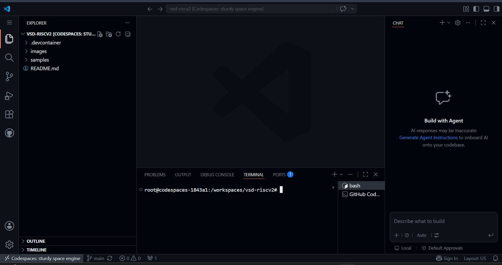
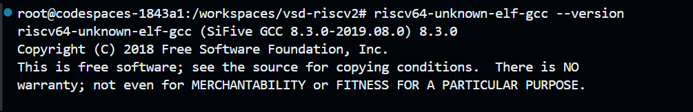
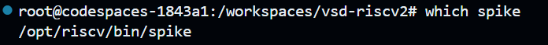
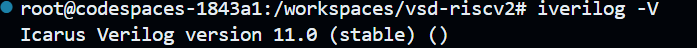
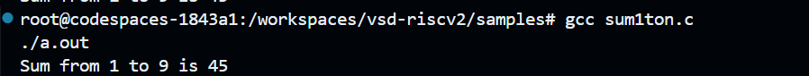
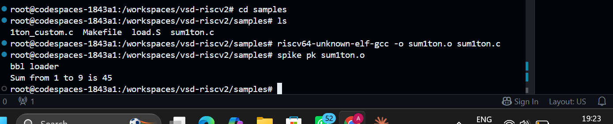
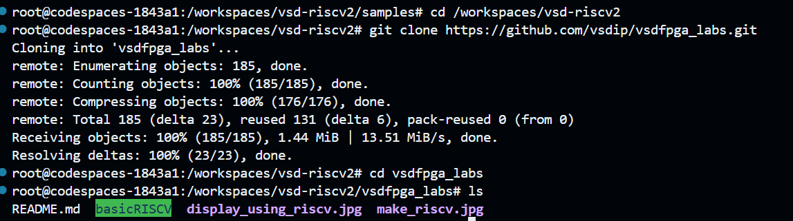
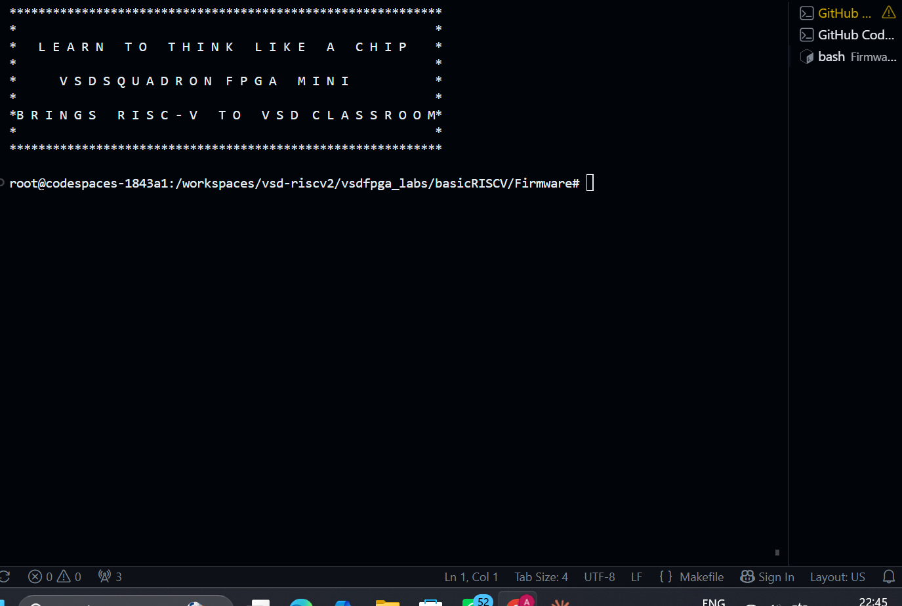
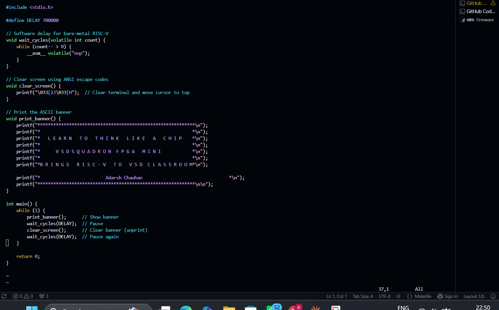
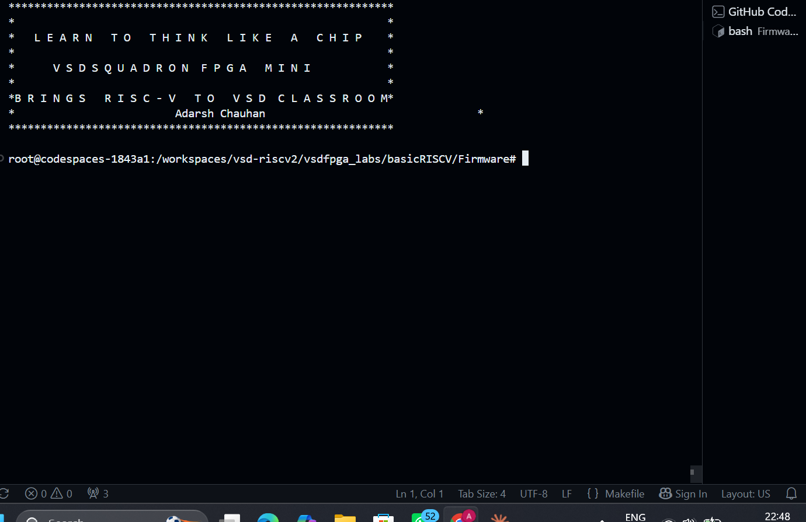

# TASK 1 - Environment Setup and RISC-V Reference Bring-Up

This task establishes a GitHub Codespace development environment and verifies the full RISC-V toolchain by compiling and executing a reference program on both native GCC and the Spike ISA simulator. It then clones and builds the VSDFPGA labs reference SoC firmware, confirming that the cross-compilation and hex generation pipeline works correctly inside the Codespace. The task concludes with a firmware banner customization to validate complete edit-compile-run capability as preparation for upcoming FPGA and IP development work.

---

## Environment Setup

### Step 1: Fork and Launch Codespace

- Forked `vsdip/vsd-riscv2` to personal GitHub account
- Launched GitHub Codespace from the fork
- Codespace built successfully with `riscv64-unknown-elf-gcc`, `spike`, and `iverilog` pre-installed



---

### Step 2: Verify Toolchain Installation

**Command:**

```bash
riscv64-unknown-elf-gcc --version
```



**Command:**

```bash
spike --help
```



**Command:**

```bash
iverilog -V
```



These commands confirm that the RISC-V cross compiler, the Spike ISA simulator, and the Verilog simulator are correctly installed inside the Codespace.

---

## RISC-V Reference Program Verification

The reference program `sum1ton.c` is located at `vsd-riscv2/samples/sum1ton.c`. It calculates the sum of numbers from 1 to N.

```c
#include <stdio.h>
int main(){
    int i, sum = 0, n = 9;
    for(i = 1; i <= n; i++)
        sum = sum + i;
    printf("Sum from 1 to %d is %d \n", n, sum);
    return 0;
}
```

**Command 1: Navigate to samples directory**

```bash
cd /workspaces/vsd-riscv2/samples
```

**Command 2: Compile and run with native GCC**

```bash
gcc sum1ton.c
./a.out
```

Output:

```
Sum from 1 to 9 is 45
```



**Command 3: Compile with RISC-V GCC**

```bash
riscv64-unknown-elf-gcc -o sum1ton.o sum1ton.c
```

**Command 4: Run on Spike simulator**

```bash
spike pk sum1ton.o
```

Output:

```
bbl loader
Sum from 1 to 9 is 45
```



Both native GCC and RISC-V Spike produce identical output, confirming the cross-compiled binary executes correctly on the RISC-V ISA simulator.

---

## VSDFPGA Labs

**Command 1: Clone the labs repository**

```bash
cd /workspaces/vsd-riscv2
git clone https://github.com/vsdip/vsdfpga_labs.git
cd vsdfpga_labs
```



**Command 2: Navigate to firmware directory**

```bash
cd basicRISCV/Firmware
```

**Command 3: View directory contents**

```bash
ls
```

The `vsdfpga_labs` repository contains a complete RISC-V SoC reference design split into two folders: `Firmware` (C source code running on the RISC-V core) and `RTL` (Verilog hardware description of the SoC).

**Command 4: View the banner program source code**

```bash
cat riscv_logo.c
```

**Command 5: Build the RISC-V hex file**

```bash
make riscv_logo.bram.hex
```

This compiles `riscv_logo.c` along with supporting files into a RISC-V ELF binary, then converts it into a hex file format that can be loaded into FPGA block RAM. This step requires no FPGA hardware.

**Command 6: Compile for native x86 and run banner**

```bash
gcc riscv_logo.c -o riscv_logo_x86
timeout 3 ./riscv_logo_x86
```

Since the program runs an infinite loop, `timeout` is used to stop execution after 3 seconds. This allows viewing the banner output without running indefinitely.

Output:

```
*******************************************************
*                                                     *
*   LEARN TO THINK LIKE A CHIP                        *
*                                                     *
*        VSDSQUADRON FPGA MINI                        *
*                                                     *
*BRINGS RISC-V TO VSD CLASSROOM*
*                                                     *
*******************************************************
```



---

## Firmware Customization

**Command 1: Edit the source file**

```bash
vim riscv_logo.c
```

Modification made: Added a new `printf` line inside the `print_banner` function to display a personal identifier.

Code change:

```c
printf("*              Adarsh Chauhan                         *\n");
```

This line was added immediately after the existing line:

```c
printf("*BRINGS  RISC-V  TO  VSD CLASSROOM*\n");
```



**Command 2: Rebuild and run with the change**

```bash
gcc riscv_logo.c -o riscv_logo_x86
timeout 3 ./riscv_logo_x86
```

Output:

```
*******************************************************
*                                                     *
*   LEARN TO THINK LIKE A CHIP                        *
*                                                     *
*        VSDSQUADRON FPGA MINI                        *
*                                                     *
*BRINGS RISC-V TO VSD CLASSROOM*
*              Adarsh Chauhan                         *
*******************************************************
```



**Command 3: Rebuild the RISC-V hex file with the change**

```bash
make riscv_logo.bram.hex
```

This confirms the modified source code compiles correctly for RISC-V as well, producing an updated hex file ready for FPGA block RAM loading.

---

## Understanding Questions and Answers

**Question 1: Where is the RISC-V program located in the vsd-riscv2 repository?**

The toolchain validation program is located at `vsd-riscv2/samples/sum1ton.c`. The FPGA firmware source files are located at `vsdfpga_labs/basicRISCV/Firmware`, with `riscv_logo.c` containing the banner program that runs on the RISC-V core.

---

**Question 2: How is the program compiled and loaded into memory?**

The program is compiled using the RISC-V cross compiler with the command `riscv64-unknown-elf-gcc -o sum1ton.o sum1ton.c`, producing a RISC-V ELF binary. This binary is then executed using `spike pk sum1ton.o`, where Spike loads the ELF sections into simulated memory and the proxy kernel (`pk`) handles system calls such as those triggered by `printf`.

---

**Question 3: How does the RISC-V core access memory and memory-mapped IO?**

RISC-V uses a unified address space for both RAM and peripherals. The same load and store instructions (`lw`, `sw`, `ld`, `sd`) are used for both. When the address targets a peripheral register instead of RAM, the connected hardware module responds to that read or write instead of memory. For example, writing to the UART transmit register address causes the `emitter_uart.v` module to send that byte over the serial line.

---

**Question 4: Where would a new FPGA IP block logically integrate in this system?**

A new IP block would integrate at four levels. First, the Verilog module is added in `basicRISCV/RTL` and instantiated in the top-level `riscv.v` file. Second, a unique address range is reserved for the IP in the address decoder, so loads and stores to that range route to the new module. Third, if the IP has external signals, pin assignments are added to `VSDSquadronFM.pcf`. Fourth, firmware code in `basicRISCV/Firmware` is written to read from and write to the IP using volatile pointer casts to access its memory-mapped registers.

---

## Conclusion

This task successfully established the GitHub Codespace development environment with all required RISC-V tools confirmed operational. The toolchain was validated end-to-end by compiling `sum1ton.c` with both native GCC and the RISC-V cross compiler, with the Spike simulator producing identical output, confirming correct ISA-level execution. The VSDFPGA labs reference SoC was cloned, its firmware built into a block RAM hex file, and the banner program executed natively to verify the complete compilation pipeline. The firmware was then customized by adding a personal identifier line to `riscv_logo.c`, with a successful rebuild confirming full edit-compile-run capability within the Codespace environment.
