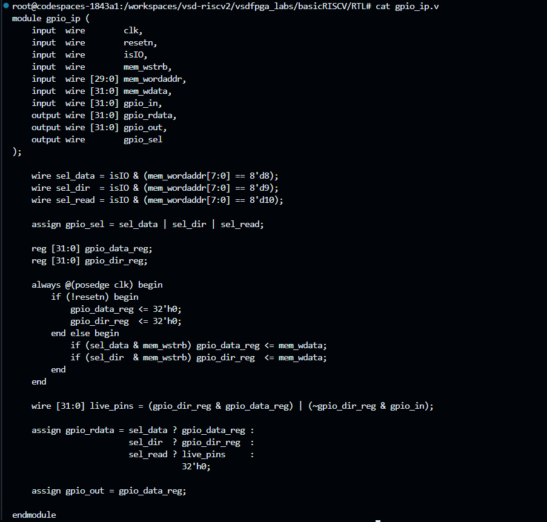
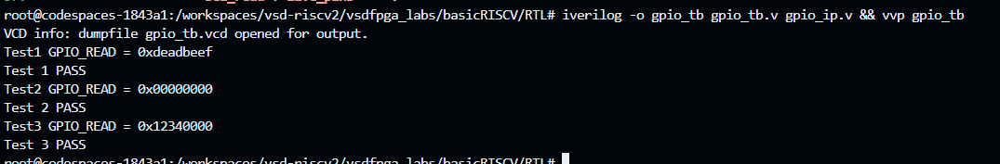
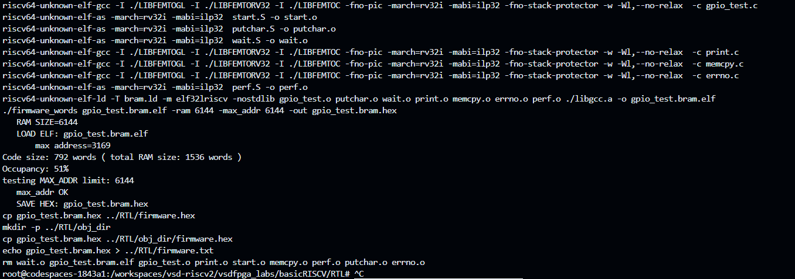
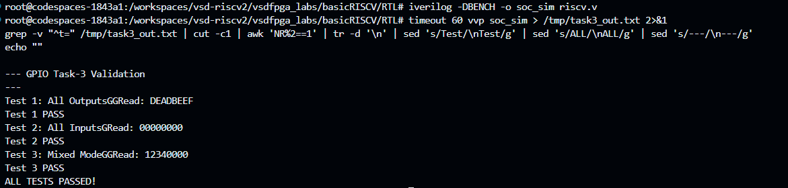
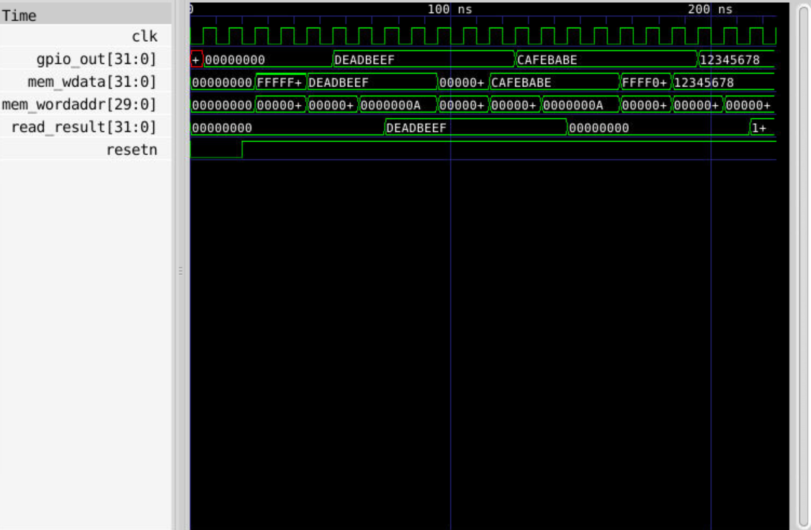

# Task-3: Multi-Register GPIO IP with Software Control

> **VSD Squadron Internship — RISC-V SoC Peripheral Design Series**  
> Extends Task-2's single-register GPIO into a realistic 3-register peripheral with direction control, data output, and live-pin readback — validated end-to-end from C firmware through the RISC-V CPU and bus fabric.

---

## Table of Contents

1. [Objective](#1-objective)
2. [IP Specification — Register Map](#2-ip-specification--register-map)
3. [Key Design Decision — Collision Avoidance](#3-key-design-decision--collision-avoidance)
4. [GPIO IP RTL — gpio_ip.v](#4-gpio-ip-rtl--gpio_ipv)
5. [SoC Integration — 4 Edits to riscv.v](#5-soc-integration--4-edits-to-riscvv)
6. [Standalone Testbench Verification](#6-standalone-testbench-verification)
7. [Firmware — gpio_test.c](#7-firmware--gpio_testc)
8. [Full-SoC Simulation Result](#8-full-soc-simulation-result)
9. [GTKWave Waveform Analysis](#9-gtkwave-waveform-analysis)
10. [Summary](#10-summary)

---

## 1. Objective

Task-2 implemented a minimal GPIO peripheral with a single register mapped to a single IO bit. Task-3 extends this into a proper multi-register peripheral that mirrors how real SoC GPIO blocks are architected:

- Implement a **3-register register map** — `GPIO_DATA`, `GPIO_DIR`, and `GPIO_READ`
- Add **per-bit direction control**: each bit independently configurable as input or output
- Support **live-pin readback**: output-configured bits reflect the driven value; input-configured bits reflect external pin state (tied to `0` in simulation)
- Validate the full path: **C firmware → RISC-V CPU → bus → IP → bus → firmware readback**
- Visualize bus transactions using **GTKWave** waveform analysis on a standalone testbench VCD dump

---

## 2. IP Specification — Register Map

**Base Address:** IO bit-3 space (same as Task-2). All accesses go through the IO address window (`isIO = 1`). Byte offsets 32 / 36 / 40 map to word addresses 8 / 9 / 10.

| Byte Offset | Word Address | Register    | Description |
|:-----------:|:------------:|:-----------:|:------------|
| `0x00` / 32 | 8            | `GPIO_DATA` | Output data register — write sets output value; read returns last written value |
| `0x04` / 36 | 9            | `GPIO_DIR`  | Direction register — `1` = output, `0` = input, per bit |
| `0x08` / 40 | 10           | `GPIO_READ` | Readback — output pins reflect driven value; input pins read as `0` (no external pins in simulation) |

> **Note:** Word addresses 9 and 10 overlap with the UART_DAT and UART_CNTL bit positions in the existing `riscv.v` IO decode logic. This collision must be explicitly handled — see §3.

---

## 3. Key Design Decision — Collision Avoidance

In Task-2, the single GPIO register used `mem_wordaddr[3]` (bit 3) as the select condition. In Task-3, the three registers occupy word addresses **8, 9, and 10**:

| Word Address | Binary Bits Set | Collision With |
|:---:|:---:|:---|
| 8  | bit 3 only | GPIO only (safe) |
| 9  | bits 3 + 0 — `UART_DAT` bit | **Spurious UART byte on every GPIO_DIR write** |
| 10 | bits 3 + 1 — `UART_CNTL` bit | **Spurious UART status read / LED write on every GPIO_READ access** |

Without a fix, writing to `GPIO_DIR` (word addr 9) would also fire the `uart_valid` signal, causing the UART peripheral to transmit garbage. Writing to `GPIO_READ` (word addr 10) would trigger the LED write path.

**Fix:** Export `gpio_sel` from `gpio_ip.v` as a top-level output and guard both `uart_valid` and the `LEDS` write enable with `& !gpio_sel` in `riscv.v`. When `gpio_sel` is high, the IO decoder is effectively muted for all other peripheral paths.

```
gpio_sel = sel_data | sel_dir | sel_read
         = isIO & (wordaddr == 8 || wordaddr == 9 || wordaddr == 10)
```

---

## 4. GPIO IP RTL — `gpio_ip.v`



```verilog
module gpio_ip (
    input  wire        clk,
    input  wire        resetn,
    input  wire        isIO,
    input  wire        mem_wstrb,
    input  wire [29:0] mem_wordaddr,
    input  wire [31:0] mem_wdata,
    input  wire [31:0] gpio_in,
    output wire [31:0] gpio_rdata,
    output wire [31:0] gpio_out,
    output wire        gpio_sel
);
    wire sel_data = isIO & (mem_wordaddr[7:0] == 8'd8);
    wire sel_dir  = isIO & (mem_wordaddr[7:0] == 8'd9);
    wire sel_read = isIO & (mem_wordaddr[7:0] == 8'd10);

    assign gpio_sel = sel_data | sel_dir | sel_read;

    reg [31:0] gpio_data_reg;
    reg [31:0] gpio_dir_reg;

    always @(posedge clk) begin
        if (!resetn) begin
            gpio_data_reg <= 32'h0;
            gpio_dir_reg  <= 32'h0;
        end else begin
            if (sel_data & mem_wstrb) gpio_data_reg <= mem_wdata;
            if (sel_dir  & mem_wstrb) gpio_dir_reg  <= mem_wdata;
        end
    end

    wire [31:0] live_pins = (gpio_dir_reg & gpio_data_reg) | (~gpio_dir_reg & gpio_in);

    assign gpio_rdata = sel_data ? gpio_data_reg :
                        sel_dir  ? gpio_dir_reg  :
                        sel_read ? live_pins     :
                                   32'h0;

    assign gpio_out = gpio_data_reg;

endmodule
```

### Design Points

| Signal / Construct | Rationale |
|:---|:---|
| `gpio_sel` is a **top-level output** | Allows `riscv.v` to suppress UART and LED decode paths when a GPIO register is addressed — the IP owns its own address decode |
| `gpio_rdata` is a **combinational wire** | Reads are zero-latency; the testbench must capture `gpio_rdata` while `isIO` is still asserted, before deasserting it |
| `live_pins` formula | `(dir & data) \| (~dir & gpio_in)` — output bits return driven value, input bits return external pin (tied to `0` in simulation) |
| `gpio_out = gpio_data_reg` | Output register is **unmasked by direction**; direction only gates the readback path, not the physical output register |
| Two writable registers, one read-only | `GPIO_DATA` and `GPIO_DIR` are clocked registers; `GPIO_READ` is purely combinational — no write path needed |

---

## 5. SoC Integration — 4 Edits to `riscv.v`

All changes are additive guards; no existing signal logic is removed.

### Edit 1 — Updated GPIO Instantiation

Replace the Task-2 single-wire instantiation with the full port list, including `gpio_in` (tied to 0 for simulation) and the new `gpio_sel` output:

```verilog
wire [31:0] gpio_rdata;
wire [31:0] gpio_out;
wire        gpio_sel;
wire [31:0] gpio_in = 32'h0;

gpio_ip GPIO(
    .clk(clk), .resetn(resetn), .isIO(isIO),
    .mem_wstrb(mem_wstrb),
    .mem_wordaddr(mem_wordaddr),
    .mem_wdata(mem_wdata),
    .gpio_in(gpio_in),
    .gpio_rdata(gpio_rdata),
    .gpio_out(gpio_out),
    .gpio_sel(gpio_sel)
);
```

### Edit 2 — LEDS Write Guard

Prevent GPIO word-address 10 from spuriously asserting the LED write enable:

```verilog
if(isIO & mem_wstrb & mem_wordaddr[IO_LEDS_bit] & !gpio_sel) begin
```

### Edit 3 — UART Valid Guard

Prevent GPIO word-address 9 from spuriously triggering UART transmit:

```verilog
wire uart_valid = isIO & mem_wstrb & mem_wordaddr[IO_UART_DAT_bit] & !gpio_sel;
```

### Edit 4 — IO Read-Data Mux

Wire `gpio_rdata` into the read-data return path with `gpio_sel` as the select condition:

```verilog
wire [31:0] IO_rdata =
    (mem_wordaddr[IO_UART_CNTL_bit] & !gpio_sel) ? {22'b0, !uart_ready, 9'b0}
    : gpio_sel ? gpio_rdata
    : 32'b0;
```

The UART CNTL read is guarded with `!gpio_sel` (word address 10 overlaps UART_CNTL). When `gpio_sel` is asserted, `gpio_rdata` is returned instead.

---

## 6. Standalone Testbench Verification

The standalone `gpio_tb.v` exercises the IP in isolation using `write_reg` / `read_reg` tasks. A critical implementation detail: because `gpio_rdata` is purely combinational and depends on `isIO`, the testbench must **capture the read result while `isIO` is still high** — asserting `isIO` low before sampling returns stale zero.

```bash
iverilog -o gpio_tb gpio_tb.v gpio_ip.v && vvp gpio_tb
```



```
Test1 GPIO_READ = 0xdeadbeef
Test 1 PASS
Test2 GPIO_READ = 0x00000000
Test 2 PASS
Test3 GPIO_READ = 0x12340000
Test 3 PASS
```

| Test | DIR Config | DATA Written | GPIO_READ Expected | Result |
|:----:|:----------:|:------------:|:-----------------:|:------:|
| 1 | `0xFFFFFFFF` (all output) | `0xDEADBEEF` | `0xDEADBEEF` | PASS |
| 2 | `0x00000000` (all input)  | `0xCAFEBABE` | `0x00000000` | PASS |
| 3 | `0xFFFF0000` (mixed)      | `0x12345678` | `0x12340000` | PASS |

Test 3 validates the `live_pins` masking: only the upper 16 bits (configured as outputs) are reflected. Lower 16 bits are input-configured, so they read as `0`.

---

## 7. Firmware — `gpio_test.c`

### Register Definitions in `io.h`

```c
#define IO_GPIO_DATA 32
#define IO_GPIO_DIR  36
#define IO_GPIO_READ 40
```

These map to the byte offsets in the GPIO register map. The firmware accesses them via pointer dereferences into the IO address space.

### Test Scenarios

| Test | DIR Written | DATA Written | Expected Read | Validates |
|:----:|:-----------:|:------------:|:-------------:|:----------|
| 1 — All Outputs | `0xFFFFFFFF` | `0xDEADBEEF` | `DEADBEEF` | All output bits reflected in GPIO_READ |
| 2 — All Inputs  | `0x00000000` | `0xCAFEBABE` | `00000000` | Input-configured bits masked to 0 |
| 3 — Mixed Mode  | `0xFFFF0000` | `0x12345678` | `12340000` | Upper outputs reflected; lower inputs zeroed |

### Build Command

```bash
cd Firmware && make gpio_test.bram.hex && cd ../RTL
```



The Makefile cross-compiles with `riscv64-unknown-elf-gcc` targeting `rv32i`, links against `bram.ld`, and packs the output into a hex image loaded by the simulation testbench.

---

## 8. Full-SoC Simulation Result

The complete simulation runs the RISC-V CPU executing `gpio_test.bram.hex` against the full `riscv.v` SoC (including GPIO IP, UART, and LED peripherals).

```bash
iverilog -DBENCH -o soc_sim riscv.v
timeout 60 vvp soc_sim
```



```
--- GPIO Task-3 Validation ---

Test 1: All Outputs
Read: DEADBEEF
Test 1 PASS

Test 2: All Inputs
Read: 00000000
Test 2 PASS

Test 3: Mixed Mode
Read: 12340000
Test 3 PASS

ALL TESTS PASSED!
```

This confirms the full signal chain: C firmware writes IO-mapped addresses → bus transaction reaches GPIO IP → IP latches registers → firmware reads back correct values → UART prints pass/fail — with no spurious UART or LED side effects from GPIO address collisions.

---

## 9. GTKWave Waveform Analysis

The testbench dumps a VCD file (`gpio_tb.vcd`). Loaded into GTKWave via the Codespace noVNC desktop (port 6080).

**Signals added:** `clk`, `resetn`, `mem_wdata[31:0]`, `mem_wordaddr[29:0]`, `read_result[31:0]`, `gpio_out[31:0]` — all set to hex format. View zoomed to fit (0–225 ns).



### Waveform Annotations

| Observation | Signal | Value / Behavior |
|:---|:---|:---|
| Reset releases | `resetn` | Deasserts low → high at simulation start |
| DIR write (Test 1) | `mem_wdata` | `FFFFFFFF` with `mem_wordaddr = 9` |
| DATA write (Test 1) | `mem_wdata` | `DEADBEEF` with `mem_wordaddr = 8` |
| Output register updated | `gpio_out` | Transitions `00000000` → `DEADBEEF` after DATA write |
| Read result captured (Test 1) | `read_result` | `DEADBEEF` — matches expected |
| All-inputs mask (Test 2) | `read_result` | `00000000` — `CAFEBABE` written but masked entirely |
| Mixed-mode readback (Test 3) | `read_result` | `12340000` — upper 16 bits reflected, lower 16 zeroed |

The waveform provides direct visual confirmation that:
1. `gpio_out` updates on the clock edge after a valid DATA write
2. Direction masking is applied combinationally during the read phase
3. `read_result` captures the correct value when `isIO` is asserted during the read task

---

## 10. Summary

Task-3 extends the single-register Task-2 GPIO IP into a production-style 3-register peripheral with direction control, output drive, and live-pin readback.

### Key Engineering Decisions

| Decision | Detail |
|:---|:---|
| **Export `gpio_sel` from IP** | The IP owns its address decode; the top-level integrator guards other peripheral paths using this signal — clean separation of concerns |
| **Guard `uart_valid` and LEDS with `!gpio_sel`** | Word addresses 9 and 10 collide with UART_DAT and UART_CNTL bit positions; without guards, every GPIO_DIR or GPIO_READ access would trigger spurious UART bytes |
| **Combinational `gpio_rdata`** | Zero-latency reads; the testbench must sample while `isIO` is still asserted — an important protocol subtlety for correct simulation |
| **`gpio_out` unmasked by direction** | Direction only gates the readback computation (`live_pins`), not the output register itself — consistent with standard GPIO peripheral behavior |
| **`gpio_in` tied to `0` in simulation** | No external pin model in simulation; input-configured bits read as `0` — verified explicitly by Test 2 and Test 3 |

### Test Coverage

| Layer | Tool | Result |
|:---:|:---:|:---:|
| IP standalone | `iverilog` + `gpio_tb.v` | 3/3 PASS |
| Firmware build | `riscv64-unknown-elf-gcc` | Built cleanly |
| Full SoC simulation | `iverilog -DBENCH` + `vvp` | 3/3 PASS |
| Waveform verification | GTKWave VCD analysis | Visually confirmed |

> **Hardware synthesis / bitstream generation:** Not performed — marked optional in the Task-3 specification with no grading impact.

---

*VSD Squadron Internship — RISC-V SoC Peripheral Design | Task-3*
