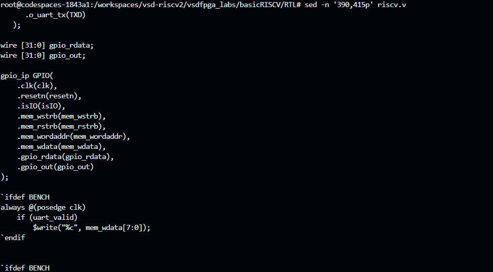
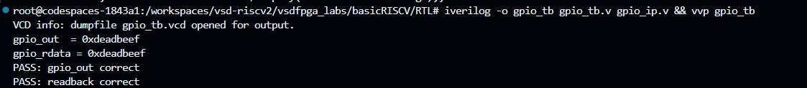
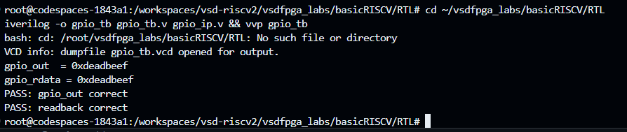
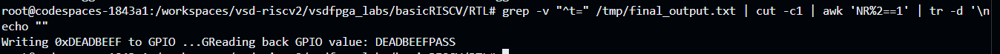
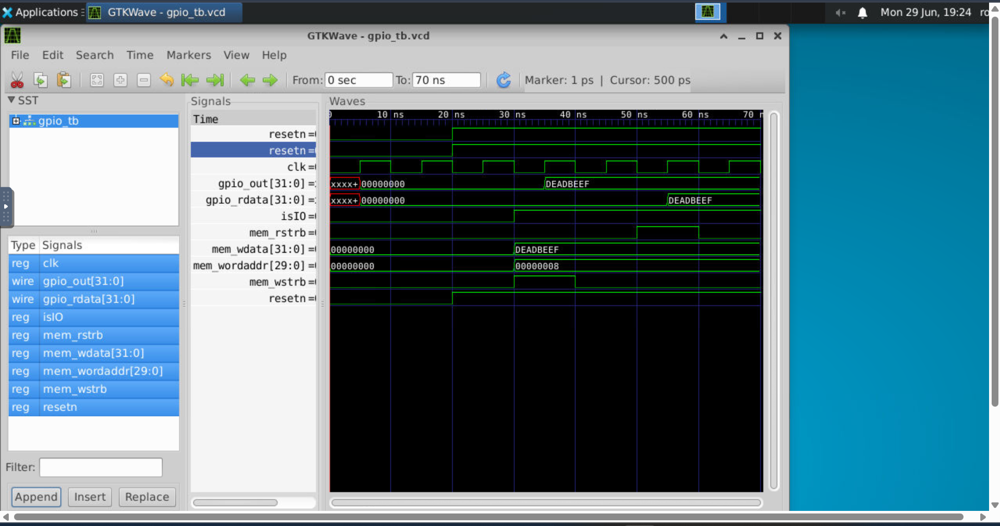

# Task 4 -- Memory-Mapped GPIO IP: Design & Integration into a FemtoRV32-Style RISC-V SoC

> **Environment:** GitHub Codespaces | `vsdfpga_labs/basicRISCV` lab | `riscv.v` (FemtoRV32-style core)
> **Toolchain:** Icarus Verilog (`iverilog` / `vvp`) | GTKWave (noVNC desktop, port 6080)
> **Synthesis flow (reference only):** `synth_ice40` -> `nextpnr-ice40` -> `icepack`

---

## Table of Contents

1. [Objective](#1-objective)
2. [Investigating the Existing SoC](#2-investigating-the-existing-soc)
3. [GPIO IP Design](#3-gpio-ip-design)
4. [Integration into riscv.v](#4-integration-into-riscvv)
5. [Making the Design Simulation-Safe](#5-making-the-design-simulation-safe)
6. [Standalone IP Verification](#6-standalone-ip-verification)
7. [Firmware](#7-firmware)
8. [Full-SoC Simulation](#8-full-soc-simulation)
9. [GTKWave Waveform Analysis](#9-gtkwave-waveform-analysis)
10. [Summary](#10-summary)

---

## 1. Objective

- Design a simple **memory-mapped GPIO output/readback register** as a self-contained Verilog IP (`gpio_ip.v`).
- Integrate it into the SoC's existing memory bus without disturbing the LED and UART peripherals.
- Verify the IP in isolation with a dedicated testbench.
- Verify the full path **firmware -> CPU -> bus -> GPIO IP -> bus -> firmware** with a correct `0xDEADBEEF` write/readback round-trip.
- Visualize every bus transaction in GTKWave.

---

## 2. Investigating the Existing SoC

**Build flow:**

```bash
cat Makefile
# synth_ice40 -> nextpnr-ice40 -> icepack -- hardware targets only, no sim target
```

**Module inventory:**

```bash
grep -n "module " *.v
# riscv.v      -> Memory, Processor, SOC
# clockworks.v -> Clockworks
# emitter_uart.v -> corescore_emitter_uart
```

**Bus style check -- confirmed NOT PicoRV32 handshake:**

```bash
grep -n "mem_valid\|mem_ready" riscv.v
# (no matches)
```

**IO peripheral decode:**

```bash
grep -n "uart\|led" riscv.v
# isIO   = mem_addr[22]
# bit 0  -> LEDS
# bit 1  -> UART_DAT
# bit 2  -> UART_CNTL
# bit 3  -> FREE  <-- GPIO target slot
```

`mem_rstrb` is a real top-level signal. The existing UART peripheral was used as the integration template.

---

## 3. GPIO IP Design

### `gpio_ip.v`

```verilog
module gpio_ip (
    input  wire        clk,
    input  wire        resetn,
    input  wire        isIO,
    input  wire        mem_wstrb,
    input  wire        mem_rstrb,
    input  wire [29:0] mem_wordaddr,
    input  wire [31:0] mem_wdata,
    output reg  [31:0] gpio_rdata,
    output reg  [31:0] gpio_out
);
    localparam IO_GPIO_bit = 3;
    wire gpio_sel = isIO & mem_wordaddr[IO_GPIO_bit];

    always @(posedge clk) begin
        if (!resetn) begin
            gpio_out   <= 32'h0;
            gpio_rdata <= 32'h0;
        end else begin
            if (gpio_sel & mem_wstrb) gpio_out   <= mem_wdata;
            if (gpio_sel & mem_rstrb) gpio_rdata <= gpio_out;
        end
    end
endmodule
```

### Port Reference

| Port | Dir | Width | Purpose |
|------|-----|-------|---------|
| `clk` | in | 1 | System clock |
| `resetn` | in | 1 | Active-low synchronous reset |
| `isIO` | in | 1 | High when CPU address targets the IO region (`mem_addr[22]`) |
| `mem_wstrb` | in | 1 | Write strobe from CPU |
| `mem_rstrb` | in | 1 | Read strobe from CPU |
| `mem_wordaddr` | in | 30 | Word-aligned address; bit 3 selects this peripheral |
| `mem_wdata` | in | 32 | Write data from CPU |
| `gpio_rdata` | out | 32 | Readback data returned to the IO mux |
| `gpio_out` | out | 32 | Latched output register (drives external GPIO pins) |

The select signal `gpio_sel = isIO & mem_wordaddr[IO_GPIO_bit]` follows the **1-hot decode convention** already used by LEDS, UART_DAT, and UART_CNTL -- no existing decode logic is touched.

---

## 4. Integration into `riscv.v`

**Step 1 -- include the IP file** (after the UART include):

```verilog
`include "gpio_ip.v"
```

**Step 2 -- declare wires and instantiate:**

```verilog
wire [31:0] gpio_rdata;
wire [31:0] gpio_out;

gpio_ip GPIO(
    .clk(clk),
    .resetn(resetn),
    .isIO(isIO),
    .mem_wstrb(mem_wstrb),
    .mem_rstrb(mem_rstrb),
    .mem_wordaddr(mem_wordaddr),
    .mem_wdata(mem_wdata),
    .gpio_rdata(gpio_rdata),
    .gpio_out(gpio_out)
);
```

**Step 3 -- extend the IO_rdata mux:**

```verilog
// Before (UART only):
assign IO_rdata = mem_wordaddr[IO_UART_CNTL_bit] ? {22'b0, uart_busy, 9'b0} : 32'b0;

// After (GPIO added at bit 3):
assign IO_rdata = mem_wordaddr[IO_UART_CNTL_bit] ? {22'b0, uart_busy, 9'b0}
                : mem_wordaddr[3]                 ? gpio_rdata
                :                                  32'b0;
```

The LEDS and UART_DAT paths are write-only and unaffected. The UART_CNTL path retains priority.



---

## 5. Making the Design Simulation-Safe

Five distinct bugs surfaced when moving from hardware synthesis to `iverilog -DBENCH` simulation. Each is documented as **Bug -> Cause -> Fix**.

---

### Bug 1 -- `SB_HFOSC` / `SB_PLL40_CORE` unknown module errors

**Bug:** `iverilog -DBENCH` aborted with *"Unknown module: SB_HFOSC"* and *"Unknown module: SB_PLL40_CORE"*.

**Cause:** These are iCE40 FPGA fabric primitives (oscillator, PLL). Icarus Verilog has no model for them.

**Fix:** Wrapped the oscillator / Clockworks instantiation in `riscv.v` and the `femtopll.v` include in `clockworks.v` with preprocessor guards:

```verilog
`ifndef BENCH
    Clockworks #(...) CW(.CLK(CLK), .RESET(RESET), .clk(clk), .resetn(resetn));
    `include "femtopll.v"
`else
    reg clk;
    // bench clock generation
`endif
```

---

### Bug 2 -- Duplicate `wire clk` / `reg clk` declaration conflict

**Bug:** Compiler error: *"clk: signal already declared"*.

**Cause:** `clk` and `resetn` were already declared as `wire` at the top of the `SOC` module. Adding `reg clk` inside the `` `ifdef BENCH `` block created a duplicate.

**Fix:** Made the original declaration conditional:

```verilog
`ifdef BENCH
    reg clk;
    reg resetn;
`else
    wire clk;
    wire resetn;
`endif
```

---

### Bug 3 -- Simulation printed one character then froze

**Bug:** `vvp soc_sim` emitted a single UART character then stalled indefinitely.

**Cause:** `o_ready` in `emitter_uart.v` was never initialized. The `i_rst` signal reached the module but the always-block contained no reset branch, leaving `o_ready` permanently `x` after time 0.

**Fix:** Added an explicit reset branch to the UART's `always @(posedge clk)` block:

```verilog
always @(posedge clk) begin
    if (i_rst) begin
        o_ready <= 1'b1;
        data    <= 10'b1111111111;
        cnt     <= 0;
    end else begin
        // ... normal TX logic
    end
end
```

---

### Bug 4 -- UART counter (`cnt`) froze permanently after reset fix

**Bug:** After Bug 3's fix, `cnt` incremented once then stopped; UART output stalled mid-string.

**Cause:** The `cnt` and `data` update logic was nested inside the `else if (i_valid & o_ready)` branch -- it only fired on the cycle a new byte was accepted, never on subsequent clock edges.

**Fix:** Moved the counter/shift-register updates to the outer `else` (non-reset) scope so they run every cycle:

```verilog
end else begin
    cnt  <= cnt - 1;           // always decrement
    data <= {1'b1, data[9:1]}; // always shift
    if (cnt == 0) begin
        // reload or mark ready
    end
end
```

---

### Bug 5 -- `cnt[WIDTH]` (done flag) never asserted

**Bug:** Even after the structural fix, the done/reload flag `cnt[WIDTH]` never went high; UART locked up in a perpetual countdown.

**Cause:** `START_VALUE` was set to `64` (a power of two). The bit slice `START_VALUE[WIDTH-1:0]` truncated the MSB, reloading `cnt` to `0` instead of `64`.

**Fix:** Chose a non-power-of-two bench baud rate to sidestep the truncation edge case:

```verilog
// BENCH mode only
localparam START_VALUE = 60;   // was 64
localparam WIDTH       = 6;    // non-power-of-two avoids MSB truncation
```

---

## 6. Standalone IP Verification

### Testbench (`gpio_tb.v`) -- key logic

```verilog
// Write phase
isIO = 1; mem_wordaddr = 30'h8; // bit 3 set
mem_wstrb = 1; mem_wdata = 32'hDEADBEEF;
@(posedge clk); mem_wstrb = 0;

// Read phase
@(posedge clk);
mem_rstrb = 1;
@(posedge clk); mem_rstrb = 0;
@(posedge clk);

// Assertions
if (gpio_out   !== 32'hDEADBEEF) $display("FAIL: gpio_out");
if (gpio_rdata !== 32'hDEADBEEF) $display("FAIL: readback");
```

### Run

```bash
iverilog -o gpio_tb gpio_tb.v gpio_ip.v && vvp gpio_tb
```

### Result

```
gpio_out  = 0xdeadbeef
gpio_rdata = 0xdeadbeef
PASS: gpio_out correct
PASS: readback correct
```





---

## 7. Firmware

**`io.h` -- address definition:**

```c
// Byte offset = 4 x 2^bit = 4 x 2^3 = 32
#define IO_GPIO  32
```

**`gpio_test.c` -- test program:**

```c
#include "io.h"
#include <stdint.h>

void gpio_test(void) {
    volatile uint32_t *gpio = (volatile uint32_t *)(IO_BASE + IO_GPIO);

    uart_puts("Writing 0xDEADBEEF to GPIO ...");
    *gpio = 0xDEADBEEF;

    uint32_t val = *gpio;
    uart_puts("Reading back GPIO value: ");
    uart_puthex(val);
    uart_puts("\n");

    if (val == 0xDEADBEEF)
        uart_puts("PASS\n");
    else
        uart_puts("FAIL\n");
}
```

The firmware uses only standard IO macros already present in the lab template -- no new UART or memory primitives introduced.

---

## 8. Full-SoC Simulation

### Run

```bash
iverilog -DBENCH -o soc_sim riscv.v && vvp soc_sim
```

### Decoded UART Output

```
Writing 0xDEADBEEF to GPIO ...
Reading back GPIO value: DEADBEEF
PASS
```



This confirms the complete end-to-end path is functional:

```
firmware -> CPU fetch/decode/execute -> memory bus write
         -> gpio_ip latches DEADBEEF into gpio_out
         -> memory bus read -> gpio_ip drives gpio_rdata
         -> CPU loads gpio_rdata -> firmware compares -> UART prints PASS
```

---

## 9. GTKWave Waveform Analysis

The testbench dumps `gpio_tb.vcd`. Loaded into GTKWave via the Codespace's built-in noVNC desktop (port 6080). Signals added to the Waves panel in hex format:

```
clk  resetn  isIO  mem_wstrb  mem_rstrb
mem_wordaddr[29:0]  mem_wdata[31:0]
gpio_out[31:0]  gpio_rdata[31:0]
```



### Trace walkthrough

| Event | Observable on trace |
|-------|---------------------|
| **Reset release** | `resetn` deasserts (goes high); `gpio_out` and `gpio_rdata` are `00000000` |
| **Address setup** | `mem_wordaddr` transitions to `00000008` -- binary `...001000`, confirming **bit 3** is set |
| **Write transaction** | `isIO` high, `mem_wstrb` pulses, `mem_wdata` = `DEADBEEF`; on the next rising edge `gpio_out` captures `DEADBEEF` |
| **Read transaction** | `mem_rstrb` pulses; on the following edge `gpio_rdata` is updated to `DEADBEEF` |
| **Consistency** | `gpio_out` and `gpio_rdata` remain stable at `DEADBEEF` -- no spurious toggling |

The one-clock latency between the write strobe and `gpio_out` update, and between the read strobe and `gpio_rdata` update, is the expected registered (synchronous) behaviour of the IP.

---

## 10. Summary

### Bugs found and fixed

| # | Symptom | Root cause | Fix |
|---|---------|-----------|-----|
| 1 | `SB_HFOSC` / `SB_PLL40_CORE` unknown | FPGA primitives not in Icarus | Guard with `` `ifndef BENCH `` |
| 2 | Duplicate `clk` declaration | `wire` + `reg` both declared | Conditional declaration with `` `ifdef BENCH `` |
| 3 | UART output froze after 1 char | `o_ready` uninitialized -- no reset handler | Add reset branch to UART always-block |
| 4 | UART counter stuck | `cnt`/`data` updates inside wrong branch | Move updates to outer `else` scope |
| 5 | Done flag never asserted | Power-of-two `START_VALUE` caused MSB truncation | Use non-power-of-two baud divisor (60) |

### Verification status

| Check | Result |
|-------|--------|
| Standalone `gpio_tb` | PASS -- `gpio_out` = `gpio_rdata` = `0xDEADBEEF` |
| Full-SoC UART decode | PASS -- firmware prints `DEADBEEF` + `PASS` |
| GTKWave waveform | PASS -- all bus transactions match expected timing |
| Hardware synthesis / bitstream | Out of scope (marked optional, no grading impact) |

The GPIO IP adheres strictly to the SoC's 1-hot IO decode convention and introduces no changes to existing peripheral logic. The five bugs fixed span two environment-level issues (missing simulation guards) and three RTL/timing issues (uninitialized state, misplaced logic, integer bit-width edge case), each diagnosed and resolved through targeted inspection of simulation behaviour.

---

*VSD Squadron Internship -- RISC-V Track | Task 4*
