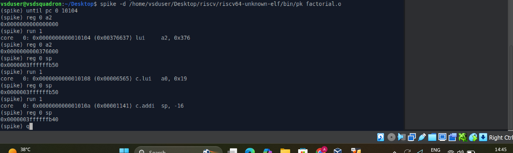

# VSDSquadron Mini Research Internship - Task 2

## RISC-V C Program: Compilation, Simulation, and Debugging

**Internship by VLSI System Design (VSD)**

---

## Table of Contents

- [Task Overview](#task-overview)
- [Program Used](#program-used)
- [Commands and Explanation](#commands-and-explanation)
- [Screenshot Descriptions](#screenshot-descriptions)
- [Key Observations](#key-observations)
- [Conclusion](#conclusion)

---

## Task Overview

Task 2 of the VSDSquadron Mini Research Internship focuses on writing a custom C program and taking it through the complete RISC-V development workflow. The objectives are:

1. Write a C program and verify it compiles and runs correctly on the local x86 machine using GCC.
2. Cross-compile the same program for the RISC-V 64-bit architecture using the RISC-V GCC toolchain.
3. Simulate execution on a RISC-V processor using the Spike RISC-V ISA Simulator with the proxy kernel.
4. Inspect the generated RISC-V assembly using `riscv64-unknown-elf-objdump` to understand how the compiler translates C to machine instructions.
5. Debug register values step by step using the Spike debugger to observe how individual instructions affect processor state.

This task bridges the gap between high-level C programming and low-level RISC-V hardware behavior.

---

## Program Used

### Factorial Calculator

The program chosen for this task is a factorial calculator written in C. It computes the factorial of 10 using a `for` loop and prints the result.

```c
#include<stdio.h>
int main(){
    int i, n=10;
    long long factorial=1;
    for(i=1; i<=n; i++){
        factorial = factorial * i;
    }
    printf("Factorial of %d is %lld\n", n, factorial);
    return 0;
}
```

### Line-by-Line Explanation

| Line | Code | Explanation |
|------|------|-------------|
| 1 | `#include<stdio.h>` | Includes the standard input/output library for using `printf` |
| 2 | `int main()` | Entry point of the program; returns an integer status code |
| 3 | `int i, n=10;` | Declares loop counter `i` and sets `n` to 10, the number whose factorial is to be calculated |
| 4 | `long long factorial=1;` | Declares `factorial` as a 64-bit integer initialized to 1, to handle large values like 10! = 3628800 |
| 5 | `for(i=1; i<=n; i++)` | Iterates from 1 to 10 inclusive |
| 6 | `factorial = factorial * i;` | Multiplies the running product by the current loop index on each iteration |
| 7 | `printf(...)` | Prints the computed factorial with proper format specifiers: `%d` for the integer `n` and `%lld` for the 64-bit `factorial` |
| 8 | `return 0;` | Signals successful program termination to the operating system |

---

## Commands and Explanation

### Command 1: Create the source file

```bash
nano factorial.c
```

**Purpose:** Opens the `nano` terminal text editor to create and write the C source file `factorial.c`. The user types the factorial program into the editor, saves with `Ctrl+O`, and exits with `Ctrl+X`.

---

### Command 2: Verify the source code

```bash
cat factorial.c
```

**Purpose:** Displays the full contents of `factorial.c` directly in the terminal. This is used to confirm that the program was saved correctly before proceeding with compilation.

---

### Command 3: Compile with GCC for the local machine

```bash
gcc factorial.c -o factorial
```

**Purpose:** Compiles the C source file using the system's native GCC compiler, which targets the local x86-64 architecture. The `-o factorial` flag specifies the name of the output executable file.

---

### Command 4: Run the compiled program

```bash
./factorial
```

**Purpose:** Executes the compiled binary on the local machine.

**Expected output:**
```
Factorial of 10 is 3628800
```

This step verifies the program logic is correct before proceeding to cross-compilation for RISC-V.

---

### Command 5: Cross-compile for RISC-V 64-bit

```bash
/home/vsduser/Desktop/riscv/bin/riscv64-unknown-elf-gcc -Ofast -o factorial.o factorial.c
```

**Purpose:** Cross-compiles the C program for the RISC-V 64-bit architecture using the RISC-V GCC toolchain installed at the specified path.

**Flag breakdown:**

| Flag | Meaning |
|------|---------|
| `-Ofast` | Applies maximum compiler optimization, enabling aggressive transformations that may exceed strict standards compliance for better performance |
| `-o factorial.o` | Names the output file `factorial.o`, which is a RISC-V ELF (Executable and Linkable Format) binary |

The resulting binary cannot run on the host x86 machine. It must be executed on a RISC-V processor or simulated using a tool like Spike.

---

### Command 6: Run on Spike ISA Simulator

```bash
spike /home/vsduser/Desktop/riscv/riscv64-unknown-elf/bin/pk factorial.o
```

**Purpose:** Executes the RISC-V ELF binary using the Spike ISA simulator. Spike is a reference implementation of the RISC-V ISA that simulates a RISC-V processor in software. The proxy kernel (`pk`) handles system calls (such as `printf`) on behalf of the bare-metal RISC-V binary, bridging it to the host OS.

**Expected output:**
```
Factorial of 10 is 3628800
```

Obtaining the same result as the native GCC run confirms that the program functions correctly on the RISC-V architecture.

---

### Command 7: Disassemble the RISC-V binary

```bash
/home/vsduser/Desktop/riscv/bin/riscv64-unknown-elf-objdump -d factorial.o | less
```

**Purpose:** Disassembles the RISC-V ELF binary to display the assembly instructions generated by the compiler. The `-d` flag requests disassembly of executable sections. The output is piped to `less` for paginated viewing. Press `q` to exit the viewer.

This reveals the actual RISC-V machine instructions corresponding to the C source code, including the `main` function and any linked runtime functions.

---

### Command 8: Launch Spike in debug mode

```bash
spike -d /home/vsduser/Desktop/riscv/riscv64-unknown-elf/bin/pk factorial.o
```

**Purpose:** Starts the Spike simulator in interactive debug mode. Execution is paused at the start, and the user can step through instructions, inspect registers, and observe processor state changes in real time.

#### Debugger commands used inside Spike:

```
(spike) until pc 0 10104
```
Runs the simulator until the program counter (PC) on core 0 reaches address `0x10104`, which is the address of the `main` function entry point as identified from the `objdump` output.

```
(spike) reg 0 a2
```
Reads and displays the current value of register `a2` on core 0. Used here to inspect `a2` before the first `lui` instruction executes.

```
(spike) run 1
```
Executes exactly one instruction and pauses. This is used for single-step instruction tracing.

```
(spike) reg 0 sp
```
Reads and displays the current value of the stack pointer register `sp` on core 0. Used to verify stack allocation after the `addi sp, sp, -16` instruction.

---

## Screenshot Descriptions

### Screenshot 1: cat factorial.c


Shows the terminal output of `cat factorial.c`. The complete C source code of the factorial program is visible, confirming the file was created and saved correctly. The `vsduser@vsdsquadron:~/Desktop$` prompt is visible, indicating the working directory.

---

### Screenshot 2: GCC compilation and execution output


Shows two commands executed in sequence:
- `gcc factorial.c -o factorial` - compiles the program with no errors
- `./factorial` - runs the binary and produces the output `Factorial of 10 is 3628800`

This confirms the program logic is correct on the native x86 machine.

---

### Screenshot 3: Spike simulator output


Shows the RISC-V cross-compilation and Spike simulation commands:
- The `riscv64-unknown-elf-gcc -Ofast` command cross-compiles the program for RISC-V
- The `spike ... pk factorial.o` command runs it on the simulator

The output `Factorial of 10 is 3628800` matches the native GCC output exactly, confirming successful execution on the simulated RISC-V processor.

---

### Screenshot 4: objdump RISC-V assembly


Shows the disassembled RISC-V binary. Key sections visible:

- `factorial.o: file format elf64-littleriscv` - confirms the binary targets the RISC-V little-endian 64-bit architecture
- The `main` function starts at address `0x0000000000010104`
- Instructions visible include:
  - `lui a2, 0x376` - loads the upper 20-bit immediate into register `a2`
  - `lui a0, 0x19` - loads an immediate for the format string address
  - `addi sp, sp, -16` - allocates 16 bytes on the stack
  - `addi a2, a2, -256` - adjusts `a2` to form the full 32-bit immediate
  - `li a1, 10` - loads the constant 10 into `a1`
  - `sd ra, 8(sp)` - saves the return address to the stack
  - `jal 104d0 <printf>` - calls the `printf` function
  - `ld ra, 8(sp)` - restores the return address
  - `li a0, 0` - loads return value 0
  - `addi sp, sp, 16` - deallocates the stack frame
  - `ret` - returns from `main`

---

### Screenshot 5: Spike debugger register inspection



Shows a full debug session with step-by-step register inspection:

| Step | Command | Result |
|------|---------|--------|
| Run to main | `until pc 0 10104` | Simulator stops at start of `main` |
| Check a2 before LUI | `reg 0 a2` | `0x0000000000000000` - register is initially zero |
| Execute one instruction | `run 1` | Executes `lui a2, 0x376` at address `0x10104` |
| Check a2 after LUI | `reg 0 a2` | `0x0000000000376000` - upper 20 bits loaded, lower 12 bits are zero |
| Check sp before addi | `reg 0 sp` | `0x0000003fffffffb50` - initial stack pointer value |
| Execute one instruction | `run 1` | Executes `c.addi sp, -16` |
| Check sp after addi | `reg 0 sp` | `0x0000003fffffffb40` - stack pointer decremented by exactly 16 bytes |

This confirms that:
- The `LUI` instruction correctly loads the upper 20 bits of an immediate value, leaving the lower 12 bits as zero
- The `addi sp, sp, -16` instruction correctly allocates exactly 16 bytes on the stack for the function frame

---

## Key Observations

1. **Identical output across architectures:** The factorial program produces `Factorial of 10 is 3628800` on both the native x86 GCC compilation and the RISC-V Spike simulation, confirming that the RISC-V toolchain and simulator faithfully reproduce the expected behavior.

2. **Reduced instruction set design:** The RISC-V assembly generated by `objdump` uses simple, fixed-length instructions. Operations that might be a single complex instruction on x86 (such as calling a function with an absolute 32-bit address) are broken into multiple simpler RISC-V instructions such as `lui` followed by `addi`.

3. **Stack frame allocation confirmed:** The stack pointer decreased from `0x0000003fffffffb50` to `0x0000003fffffffb40` after executing `addi sp, sp, -16`, a reduction of exactly 16 bytes (decimal). This is consistent with the ABI requirement to allocate space for the saved return address on the stack.

4. **LUI instruction behavior:** The `LUI a2, 0x376` instruction loaded `0x376000` into register `a2`, which is `0x376` shifted left by 12 bits. The lower 12 bits remain zero after `LUI` and are subsequently filled in by an `addi` instruction, which is the standard RISC-V two-instruction sequence for loading a 32-bit immediate value.

5. **Compiler optimization with -Ofast:** At the `-Ofast` optimization level, the compiler computes the factorial at compile time and inlines the result directly into the binary rather than emitting loop instructions, producing a very compact `main` function that simply loads precomputed values and calls `printf`.

---

## Conclusion

Task 2 successfully demonstrated the complete workflow of writing, compiling, simulating, and debugging a C program on the RISC-V architecture. Starting from a simple factorial calculator in C, the program was verified on the native x86 machine, cross-compiled into a RISC-V ELF binary, and executed on the Spike ISA simulator to confirm correctness. The `objdump` disassembly revealed how the RISC-V compiler translates high-level constructs into a reduced set of simple instructions. Finally, step-by-step debugging using the Spike debugger provided direct insight into how individual RISC-V instructions modify register values and stack state at the hardware level. This task builds a solid foundation for understanding RISC-V instruction execution and the toolchain that supports it.

---

## Author

**Adarsh Chauhan**
VSDSquadron Mini RISC-V Research Internship

Internship offered by [VLSI System Design (VSD)](https://www.vlsisystemdesign.com/)

GitHub: [Adarshchauhan123](https://github.com/Adarshchauhan123)
